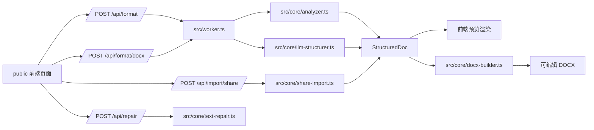
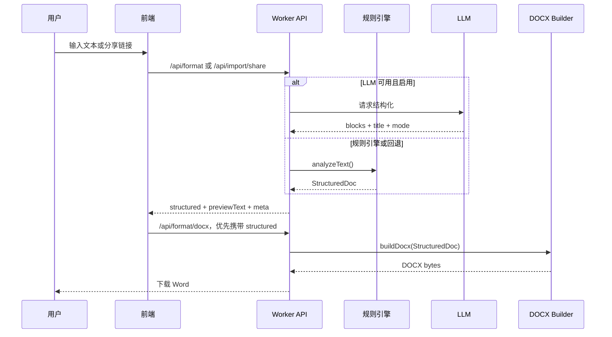

# Word Format

> 文本智能排版、公式识别、分享链接导入与 Word 导出的一体化 Cloudflare Worker。

[](https://www.typescriptlang.org/)
[](https://workers.cloudflare.com/)
[](https://vitest.dev/)
[](https://github.com/dolanmiu/docx)

线上地址：<https://word-format.aa15859014090.workers.dev/>

## 项目简介

Word Format 用于把直接复制来的中文文本、Markdown、ChatGPT/Gemini 分享内容解析成结构化文档，并导出为可编辑的 `.docx`。项目主线基于 **Cloudflare Workers + TypeScript + docx**，同时保留规则引擎与 LLM 结构化两条路径，确保在线导入失败或 LLM 不可用时仍能稳定输出。

> [!NOTE]
> 当前生产路径是 TypeScript Worker。仓库中保留的 Python 文件仅作为历史原型和格式对照，不是线上主流程。

## 核心能力

| 能力 | 说明 |
| --- | --- |
| 文本结构化 | 自动识别标题、正文、列表、参考文献、表格、公式块。 |
| Word 导出 | 生成 `.docx`，支持正文样式、标题层级、页边距、表格、公式与引用。 |
| 公式处理 | 支持 LaTeX 风格公式、上下标、分式、根式、求和、范数、箭头与公式编号。 |
| 表格处理 | 支持 Markdown 表格、三线表样式、表格内公式，以及 Gemini 导入中的异常分隔符修复。 |
| 分享链接导入 | 单独导入 ChatGPT / Gemini 公开分享链接，避免与正文输入混淆。 |
| 预览一致性 | 前端预览结构可直接传给 Word 导出，减少预览和下载结果不一致。 |
| 文本修复 | 支持常见复制污染、转义换行、Unicode 转义和零宽字符清理。 |

## 架构总览



## 处理流程



## 快速开始

```bash
npm install
npm run dev
```

本地访问：

```text
http://127.0.0.1:8787
```

常用检查：

```bash
npm run build:check
npm test
```

## API 速览

### `POST /api/format`

把原始文本解析为结构化文档，并返回前端预览需要的数据。

```json
{
  "text": "你的原始文本",
  "mode": "auto",
  "useLlm": true,
  "mathItalic": false
}
```

响应重点字段：

| 字段 | 说明 |
| --- | --- |
| `structured` | 标题、模式、块列表等结构化文档数据。 |
| `previewText` | 兼容旧逻辑的纯文本预览。 |
| `meta.engine` | 实际使用的引擎，通常是 `rule`、`llm` 或 `preview`。 |
| `meta.fallbackReason` | LLM 或导入回退原因。 |

### `POST /api/format/docx`

生成 `.docx` 二进制文件。前端下载时会优先提交已经预览过的 `structured`，让 Word 导出复用同一份结构，避免二次解析导致差异。

```json
{
  "text": "原始文本",
  "mode": "auto",
  "mathItalic": false,
  "structured": {
    "title": "文档标题",
    "mode": "thesis",
    "blocks": []
  }
}
```

响应头：

| 响应头 | 说明 |
| --- | --- |
| `Content-Type` | `application/vnd.openxmlformats-officedocument.wordprocessingml.document` |
| `X-Format-Engine` | `rule`、`llm` 或 `preview`。 |
| `X-Format-Fallback` | 回退说明，可为空。 |

### `POST /api/import/share`

导入公开分享链接，目前支持：

```text
https://chatgpt.com/share/...
https://gemini.google.com/share/...
```

请求示例：

```json
{
  "url": "https://chatgpt.com/share/..."
}
```

> [!IMPORTANT]
> Gemini 公开页可能触发 Google 反爬、Jina Reader 限流或返回缺公式内容。导入逻辑会尽量通过 Gemini RPC、渲染 HTML、Reader 等路径恢复 Markdown 和公式；当结果明显缺公式时会拒绝低质量文本，避免把坏内容继续导出。

### `POST /api/repair`

修复复制污染文本。

```json
{
  "text": "待修复文本"
}
```

返回：

```json
{
  "text": "修复后文本",
  "changed": true
}
```

## 目录地图

```text
.
├── public/                  # 前端页面、交互、预览渲染和样式
├── src/
│   ├── worker.ts            # Worker API 入口
│   └── core/
│       ├── analyzer.ts      # 规则解析、标题分级、块识别
│       ├── docx-builder.ts  # Word 样式、公式、表格和 DOCX 构建
│       ├── llm-structurer.ts# LLM 结构化与回退校验
│       ├── preview.ts       # 结构化文档的文本预览
│       ├── share-import.ts  # ChatGPT / Gemini 分享导入
│       ├── text-repair.ts   # 文本污染修复
│       └── types.ts         # 结构化文档类型
├── test/                    # Vitest 单元测试
├── scripts/                 # 集成测试脚本
├── AGENT.md                 # 大模型协作上下文
├── package.json
└── wrangler.toml
```

## 配置

`wrangler.toml` 中包含默认 LLM 配置：

```toml
MODELSCOPE_BASE_URL = "https://api-inference.modelscope.cn/v1"
MODELSCOPE_MODEL_ID = "ZhipuAI/GLM-5"
MODELSCOPE_TIMEOUT_MS = "60000"
```

密钥不要写入仓库，请使用 Wrangler Secret：

```bash
npx wrangler secret put MODELSCOPE_API_KEY
```

## 测试与质量门禁

| 命令 | 用途 |
| --- | --- |
| `npm run build:check` | TypeScript 类型检查。 |
| `npm test` | 运行 Vitest 单元测试。 |
| `npm run test:integration` | 本地端到端集成测试。 |
| `node --check public/app.js` | 快速检查前端脚本语法。 |

提交前建议至少执行：

```bash
node --check public/app.js
npm run build:check
npm test
```

## 部署

```bash
npx wrangler deploy
```

推送到 GitHub 后，Cloudflare 部署会在一段时间后同步到线上地址。涉及预览、导出或分享导入的改动，建议在线上地址再做一次闭环验证。

## 开发约定

- 修改预览渲染时，同步检查 Word 导出是否仍一致。
- 修改公式、表格、标题识别时，同步补充或更新 `test/*.test.ts`。
- 修改分享链接导入时，要考虑 ChatGPT、Gemini、Reader 代理、限流和缓存路径。
- 不提交 API Key、Cookie、会话数据和临时调试输出。
- 详细的大模型接手说明见 [AGENT.md](./AGENT.md)。
