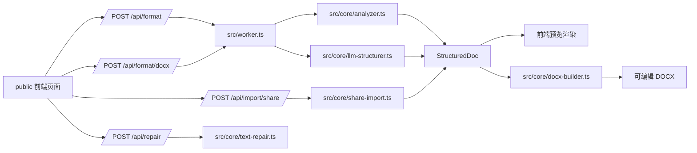
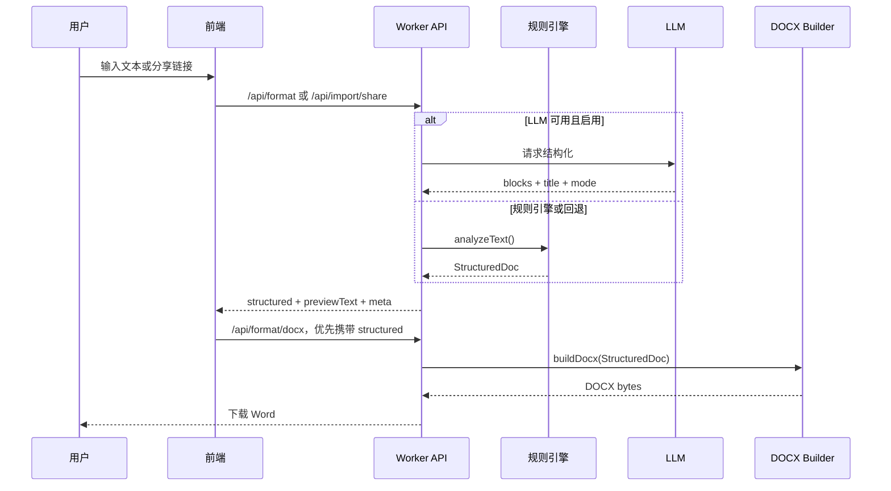

# Word Format

> 文本智能排版、公式识别、图片嵌入、分享链接导入与 Word 导出的一体化工具，支持在线版（Cloudflare Worker）和本地版（Node.js）。

[](https://www.typescriptlang.org/)
[](https://workers.cloudflare.com/)
[](https://nodejs.org/)
[](https://vitest.dev/)
[](https://github.com/dolanmiu/docx)

- **在线版**：<https://word-format.aa15859014090.workers.dev/>
- **本地版**：双击 `start.bat`（Windows）或运行 `bash start.sh`（Mac/Linux）

## 项目简介

Word Format 用于把直接复制来的中文文本、Markdown、ChatGPT/Gemini 分享内容解析成结构化文档，并导出为可编辑的 `.docx`（含图片嵌入）。项目同时提供在线版和本地版两种使用方式：

- **在线版**（Cloudflare Worker）：零安装，适合轻量文本和少量图片（< 8MB）。
- **本地版**（Node.js）：无图片数量/大小限制，支持文件流上传，适合大量图片或离线使用。

两条路径共享同一套核心代码（`src/core/`），包括文本结构化、Word 生成、公式渲染和图片嵌入。

## 核心能力

| 能力 | 说明 |
| --- | --- |
| 文本结构化 | 自动识别标题、正文、列表、参考文献、表格、公式块。 |
| Word 导出 | 生成 `.docx`，支持正文样式、标题层级、页边距、表格、公式与引用。 |
| 图片嵌入 | 图注编号自动匹配图片（如 `图1.png` 对应文本中的 `图1`），嵌入 Word。 |
| 公式处理 | 支持 LaTeX 风格公式、上下标、分式、根式、求和、范数、箭头与公式编号。 |
| 表格处理 | 支持 Markdown 表格、三线表样式、表格内公式，以及 Gemini 导入中的异常分隔符修复。 |
| 分享链接导入 | 单独导入 ChatGPT / Gemini 公开分享链接，避免与正文输入混淆。 |
| 预览一致性 | 前端预览结构可直接传给 Word 导出，减少预览和下载结果不一致。 |
| 文本修复 | 支持常见复制污染、转义换行、Unicode 转义和零宽字符清理。 |

## 架构总览



## 在线版 vs 本地版

| 特性 | 在线版（Worker） | 本地版（Node.js） |
| --- | --- | --- |
| 安装要求 | 无，浏览器直接访问 | 需要 Node.js 18+ |
| 图片传输方式 | base64 编码在 JSON 中 | 原始二进制文件流上传 |
| 图片数量限制 | 受 Worker 内存限制（建议 < 8MB 总量） | 无限制 |
| 图片大小限制 | 单张建议 < 5MB | 无限制 |
| 图片压缩 | 自动客户端压缩（有损） | 无压缩，原图嵌入 |
| 网络要求 | 需要互联网 | 完全离线可用 |
| 适用场景 | 轻量文本、少量图片 | 大量图片、离线使用、大文件 |

### 图片使用说明

1. 图片文件名需与文本中的图注编号对应，如 `图1.png` 对应文本中的 `图1 系统架构图`。
2. 支持格式：PNG、JPG/JPEG、GIF、BMP。
3. 文本中的图注格式：`图1 标题`、`图 2-1 标题`、`图1：标题` 等均可识别。
4. 本地版的图片上传使用文件流（非 base64），服务器将图片保存到 `.image-uploads/` 目录，导出时从磁盘读取。

## 处理流程



## 快速开始

### 在线版开发

```bash
npm install
npm run dev
```

本地访问 `http://127.0.0.1:8787`。

### 本地版使用

**一键启动**（推荐）：

- Windows：双击 `start.bat`
- Mac/Linux：运行 `bash start.sh`

脚本会自动检查 Node.js、安装依赖、启动本地服务器并打开浏览器。默认端口 `8788`，可通过 `PORT` 环境变量修改。

**手动启动**：

```bash
npm install
npm run local
```

### CLI 命令行

无需浏览器，直接在终端生成 Word：

```bash
# 基本用法
npx tsx src/cli.ts input.txt -o output.docx

# 指定图片目录（文件名与图注编号对应）
npx tsx src/cli.ts input.txt --images ./figures/ -o output.docx

# 指定模式和选项
npx tsx src/cli.ts input.txt --images ./figures/ --mode thesis --original-captions -o output.docx

# 从 stdin 读取
cat input.txt | npx tsx src/cli.ts - --images ./figures/ -o output.docx
```

### 常用检查

```bash
npm run build:check
npm test
```

## API 速览

### `POST /api/format`

把原始文本解析为结构化文档，并返回前端预览需要的数据。

```json
{
  "text": "你的原始文本",
  "mode": "auto",
  "useLlm": true,
  "mathItalic": false
}
```

响应重点字段：

| 字段 | 说明 |
| --- | --- |
| `structured` | 标题、模式、块列表等结构化文档数据。 |
| `previewText` | 兼容旧逻辑的纯文本预览。 |
| `meta.engine` | 实际使用的引擎，通常是 `rule`、`llm` 或 `preview`。 |
| `meta.fallbackReason` | LLM 或导入回退原因。 |

### `POST /api/format/docx`

生成 `.docx` 二进制文件。前端下载时会优先提交已经预览过的 `structured`，让 Word 导出复用同一份结构，避免二次解析导致差异。

```json
{
  "text": "原始文本",
  "mode": "auto",
  "mathItalic": false,
  "structured": {
    "title": "文档标题",
    "mode": "thesis",
    "blocks": []
  },
  "images": {
    "图1": { "base64": "...", "type": "png" }
  }
}
```

本地版使用 `imageIds` 替代 `images`（图片已通过上传 API 存储在服务器磁盘）：

```json
{
  "text": "原始文本",
  "imageIds": ["a1b2c3d4", "e5f6g7h8"]
}
```

响应头：

| 响应头 | 说明 |
| --- | --- |
| `Content-Type` | `application/vnd.openxmlformats-officedocument.wordprocessingml.document` |
| `X-Format-Engine` | `rule`、`llm` 或 `preview`。 |
| `X-Format-Fallback` | 回退说明，可为空。 |

### `POST /api/import/share`

导入公开分享链接，目前支持：

```text
https://chatgpt.com/share/...
https://gemini.google.com/share/...
```

请求示例：

```json
{
  "url": "https://chatgpt.com/share/..."
}
```

> [!IMPORTANT]
> Gemini 公开页可能触发 Google 反爬、Jina Reader 限流或返回缺公式内容。导入逻辑会尽量通过 Gemini RPC、渲染 HTML、Reader 等路径恢复 Markdown 和公式；当结果明显缺公式时会拒绝低质量文本，避免把坏内容继续导出。

### 本地版专用 API

以下端点仅在本地版服务器（`local-server.ts`）中可用：

#### `POST /api/upload-image`

上传图片（原始二进制流），元数据通过请求头传递：

| 请求头 | 说明 |
| --- | --- |
| `X-Image-Name` | 文件名（URL 编码），如 `%E5%9B%BE1.png` |
| `X-Image-Type` | 图片类型：`png`、`jpg`、`gif`、`bmp` |

返回：`{ "id": "a1b2c3d4", "name": "图1", "type": "png", "size": 12345 }`

#### `GET /api/image/:id`

根据 ID 获取已上传的图片（用于前端预览）。

#### `DELETE /api/image/:id`

删除已上传的图片。

### `POST /api/repair`

修复复制污染文本。

```json
{
  "text": "待修复文本"
}
```

返回：

```json
{
  "text": "修复后文本",
  "changed": true
}
```

## 目录地图

```text
.
├── public/                  # 前端页面、交互、预览渲染和样式
├── src/
│   ├── worker.ts            # Cloudflare Worker API 入口（在线版）
│   ├── local-server.ts      # 本地 HTTP 服务器入口（本地版）
│   ├── cli.ts               # CLI 命令行入口
│   └── core/
│       ├── analyzer.ts      # 规则解析、标题分级、块识别
│       ├── docx-builder.ts  # Word 样式、公式、表格、图片嵌入和 DOCX 构建
│       ├── llm-structurer.ts# LLM 结构化与回退校验
│       ├── preview.ts       # 结构化文档的文本预览
│       ├── share-import.ts  # ChatGPT / Gemini 分享导入
│       ├── text-repair.ts   # 文本污染修复
│       └── types.ts         # 结构化文档类型
├── test/                    # Vitest 单元测试
├── scripts/                 # 集成测试脚本
├── start.bat                # Windows 一键启动脚本
├── start.sh                 # Mac/Linux 一键启动脚本
├── AGENT.md                 # 大模型协作上下文
├── package.json
└── wrangler.toml
```

## 配置

`wrangler.toml` 中包含默认 LLM 配置：

```toml
MODELSCOPE_BASE_URL = "https://api-inference.modelscope.cn/v1"
MODELSCOPE_MODEL_ID = "ZhipuAI/GLM-5"
MODELSCOPE_TIMEOUT_MS = "60000"
```

密钥不要写入仓库，请使用 Wrangler Secret：

```bash
npx wrangler secret put MODELSCOPE_API_KEY
```

## 测试与质量门禁

| 命令 | 用途 |
| --- | --- |
| `npm run build:check` | TypeScript 类型检查。 |
| `npm test` | 运行 Vitest 单元测试。 |
| `npm run test:integration` | 本地端到端集成测试。 |
| `node --check public/app.js` | 快速检查前端脚本语法。 |

提交前建议至少执行：

```bash
node --check public/app.js
npm run build:check
npm test
```

## 部署

```bash
npx wrangler deploy
```

推送到 GitHub 后，Cloudflare 部署会在一段时间后同步到线上地址。涉及预览、导出或分享导入的改动，建议在线上地址再做一次闭环验证。

## 开发约定

- 修改预览渲染时，同步检查 Word 导出是否仍一致。
- 修改公式、表格、标题识别时，同步补充或更新 `test/*.test.ts`。
- 修改分享链接导入时，要考虑 ChatGPT、Gemini、Reader 代理、限流和缓存路径。
- 不提交 API Key、Cookie、会话数据和临时调试输出。
- 详细的大模型接手说明见 [AGENT.md](./AGENT.md)。
