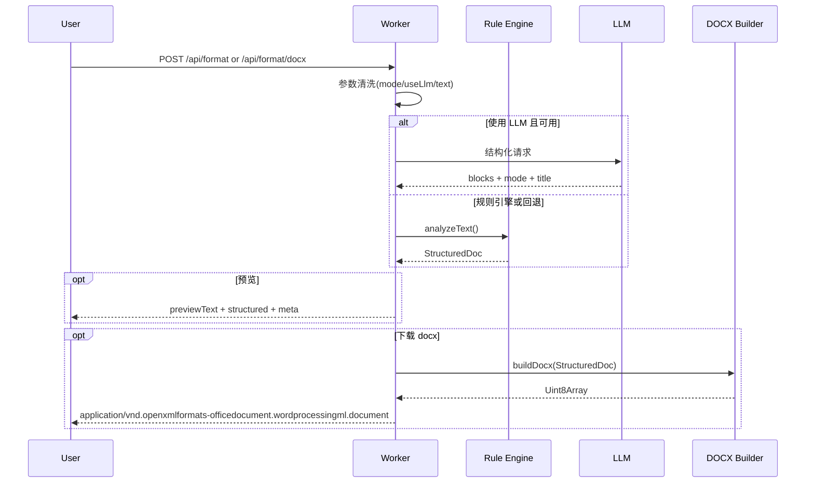

# Text Word Format Worker

将原始中文文本解析为结构化文档，并导出符合公文/论文规范的 `.docx`。项目基于 **Cloudflare Workers + TypeScript + docx**，提供规则引擎与 LLM 结构化双路径，并具备可回退的稳定处理链路。

[](https://www.typescriptlang.org/)
[](https://workers.cloudflare.com/)
[](https://vitest.dev/)

## 功能特性

- 支持 `official`、`thesis`、`auto` 三种模式。
- 规则引擎与 LLM（ModelScope）自动回退机制。
- 自动识别标题层级（一级/二级/三级）与参考文献区块。
- 正文分项 `1、`/`1.` 统一规范为 `（1）`（避免误判为标题）。
- 导出 `.docx` 时应用规范字体、页边距、行距与目录（thesis）。
- 单独支持 ChatGPT / Gemini 公开分享链接导入，避免与正文输入混用。
- 支持“深度乱码修复”与浏览器打印式 PDF 导出。

## 文档排版能力

- 标题样式：一级/二级标题为黑体，字号保持规范且不加粗。
- 公式处理：支持上下标、指数、绝对值/范数等表达式；可选公式斜体开关。
- 公式编号：采用 $1\times3$ 无边框表格模板，居中公式、右侧编号。
- 引用与参考文献：正文引用 `[n]` 生成上标并与参考文献建立内部跳转。
- 表格与题注：支持三线表样式、单元格水平/垂直居中；图表题注不加粗。
- 图题格式：使用“图N 标题”（半角空格）。

## 可视化架构

```mermaid
flowchart LR
    A[前端页面 public/] --> B[/api/format]
    A --> C[/api/format/docx]
    B --> D[worker.ts]
    C --> D
    D --> E{useLlm && API Key}
    E -- 是 --> F[llm-structurer.ts]
    E -- 否/失败 --> G[analyzer.ts]
    F --> H[StructuredDoc]
    G --> H
    H --> I[preview.ts]
    H --> J[docx-builder.ts]
    J --> K[DOCX 二进制]
```

## 处理流程



## 项目结构

```text
.
├── public/                    # 前端页面与静态资源
├── src/
│   ├── worker.ts              # Worker API 入口
│   └── core/
│       ├── analyzer.ts        # 规则分析与标题分级
│       ├── llm-structurer.ts  # LLM 结构化与校验
│       ├── docx-builder.ts    # DOCX 样式与构建
│       ├── share-import.ts    # ChatGPT / Gemini 分享链接导入
│       ├── text-repair.ts     # 深度乱码修复
│       ├── preview.ts         # 预览文本渲染
│       └── types.ts           # 类型定义
├── test/                      # 单元测试
├── scripts/integration-test.ts
├── AGENT.md                   # 代理协作规范
└── wrangler.toml              # Worker 配置
```

> 仓库保留了 Python 原型（`app.py`、`formatter.py`）用于历史对照，当前主线实现为 TypeScript Worker。

## 快速开始（Windows `cmd`）

```bat
npm install
npm run dev
```

启动后访问：`http://127.0.0.1:8787`

## API 示例

### `POST /api/format`

请求体：

```json
{
  "text": "你的原始文本",
  "mode": "auto",
  "useLlm": true,
  "mathItalic": false
}
```

返回：

- `structured`：结构化文档对象
- `previewText`：预览文本
- `meta.engine`：`llm` 或 `rule`
- `meta.fallbackReason`：LLM 回退原因（可空）

### `POST /api/format/docx`

同样请求体，返回 `.docx` 二进制流；响应头包含：

- `X-Format-Engine`
- `X-Format-Fallback`

### `POST /api/import/share`

请求体：

```json
{
  "url": "https://chatgpt.com/share/..."
}
```

返回导入后的标题、来源平台与正文文本。目前支持：

- `https://chatgpt.com/share/...`
- `https://gemini.google.com/share/...`

### `POST /api/repair`

请求体：

```json
{
  "text": "待修复文本"
}
```

返回修复后的文本与 `changed` 标记，可用于处理 `\\n`、`\\uXXXX`、零宽字符等常见复制污染。

## 标题与分项规则（当前实现）

- 一级标题：如 `一、`、`第一章`。
- 二级标题：如 `2.1`。
- 三级标题：如 `2.3.1`。
- 正文分项：`1、`/`2、`/`3、` 与 `1.`/`2.`/`3.` 自动转为 `（1）`/`（2）`/`（3）`，并保持为正文段落（非标题）。

## 环境变量

`wrangler.toml` 中默认变量：

```toml
MODELSCOPE_BASE_URL = "https://api-inference.modelscope.cn/v1"
MODELSCOPE_MODEL_ID = "ZhipuAI/GLM-5"
MODELSCOPE_TIMEOUT_MS = "60000"
```

设置 LLM 密钥（不要写入仓库）：

```bat
npx wrangler secret put MODELSCOPE_API_KEY
```

## 测试与质量保障

```bat
npm run build:check
npm test
npm run test:integration
```

## 部署

```bat
npx wrangler deploy
```

## 开发约定

- 详细代理协作规范见 `AGENT.md`。
- 新增识别规则时，请同步补充 `test/*.test.ts`。
- 修改输出格式时，建议用 `测试案例.txt` 做回归闭环。
